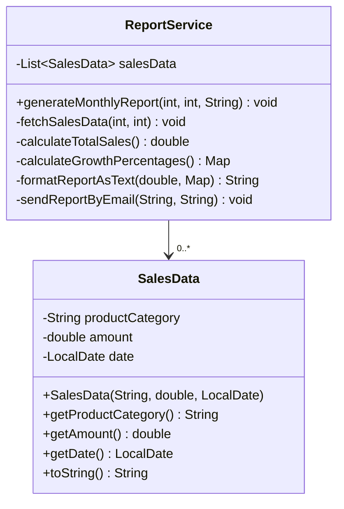

# SOLID Principles Refactoring Example - Before

This project demonstrates a "before" example of code that violates SOLID principles. The diagram and documentation below illustrate the current architecture before refactoring.

## Class Diagram

## Current Architecture

The current architecture consists of two main classes:

1. **SalesData**: A simple data model class that represents sales information for a specific product category on a specific date.

2. **ReportService**: A service class that handles the entire process of generating and sending monthly sales reports.

The `ReportService` class has a direct dependency on the `SalesData` class and manages a collection of `SalesData` objects. It orchestrates the entire reporting process from data fetching to email delivery.

## SOLID Principles Violations

This "before" example intentionally violates several SOLID principles:

### Single Responsibility Principle (SRP)

The `ReportService` class violates the SRP by handling multiple responsibilities:
- **Data fetching**: The `fetchSalesData` method retrieves sales data
- **Business logic calculations**: The `calculateTotalSales` and `calculateGrowthPercentages` methods perform business logic
- **Report formatting**: The `formatReportAsText` method handles presentation logic
- **Email sending**: The `sendReportByEmail` method handles delivery

Each of these responsibilities could change for different reasons, making the class unstable and difficult to maintain.

### Open/Closed Principle (OCP)

The current design violates the OCP because:
- Adding new report formats (e.g., HTML, PDF) would require modifying the existing `ReportService` class
- Adding new delivery methods (e.g., SMS, API) would require modifying the existing `ReportService` class
- Changing the data source would require modifying the existing `ReportService` class

### Interface Segregation Principle (ISP)

While there are no interfaces in this example, the monolithic `ReportService` class forces clients to depend on methods they don't use. For example, a client that only needs to generate a report but not send it still has to use a class that includes email sending functionality.

### Dependency Inversion Principle (DIP)

The current design violates the DIP because:
- High-level modules (report generation) depend directly on low-level modules (data fetching, email sending)
- There are no abstractions to decouple these components
- The `ReportService` class directly instantiates `SalesData` objects rather than depending on abstractions

## Issues with the Current Design

The current architecture has several issues:

1. **Tight coupling**: The components for data fetching, processing, formatting, and delivery are tightly coupled within a single class.

2. **Poor testability**: It's difficult to test individual components in isolation. For example, testing the report formatting logic requires setting up data fetching.

3. **Limited reusability**: Components cannot be easily reused in other contexts. For example, the report formatting logic cannot be used without bringing in the data fetching and email sending logic.

4. **Difficult to extend**: Adding new features or modifying existing ones requires changing the `ReportService` class, which increases the risk of introducing bugs.

5. **Violates separation of concerns**: The class mixes different levels of abstraction and different areas of functionality.

This "before" example serves as a starting point for refactoring to better adhere to SOLID principles.
