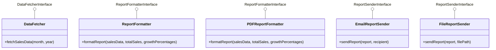

# Report Service Architecture

This document provides a visual representation of the Report Service architecture and its related classes, highlighting the implementation of SOLID principles.

## Class Diagram

## SOLID Principles Implementation

This architecture demonstrates the implementation of SOLID principles:

### Single Responsibility Principle (SRP)

Each class has a single, well-defined responsibility:
- `ReportService`: Orchestrates the report generation process
- `DataFetcher`: Retrieves sales data
- `ReportFormatter`/`PDFReportFormatter`: Format reports in different styles
- `EmailReportSender`/`FileReportSender`: Send reports through different channels
- `SalesData`: Represents sales information

### Open/Closed Principle (OCP)

The system is open for extension but closed for modification:
- New report formatters can be added without changing existing code
- New report senders can be added without changing existing code
- New data fetchers can be added without changing existing code

### Dependency Inversion Principle (DIP)

High-level modules depend on abstractions, not concrete implementations:
- `ReportService` depends on interfaces (`DataFetcherInterface`, `ReportFormatterInterface`, `ReportSenderInterface`)
- Both high-level modules and low-level modules depend on the same abstractions
- Dependencies are injected through constructor injection
- `ReportingConfig` centralizes dependency configuration

### Contrast with Non-DIP Implementation

The diagram includes `ReportServiceWithoutDIP` to illustrate the difference:
- Directly depends on concrete implementations
- Creates tight coupling between classes
- Makes testing difficult as dependencies cannot be easily substituted
- Changes to low-level modules may require changes to this class

## Benefits of This Architecture

1. **Flexibility**: Implementations can be easily swapped by changing configuration
2. **Testability**: Dependencies can be mocked for unit testing
3. **Maintainability**: Dependencies are managed in one place
4. **Loose Coupling**: High-level modules depend on abstractions, not implementations
5. **Extensibility**: New implementations can be added without modifying existing code
