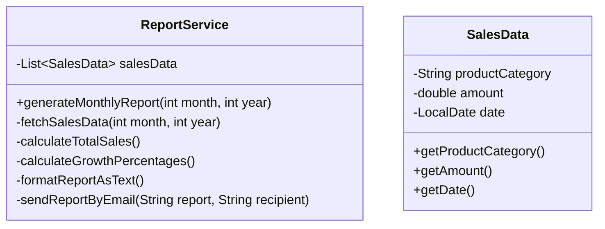
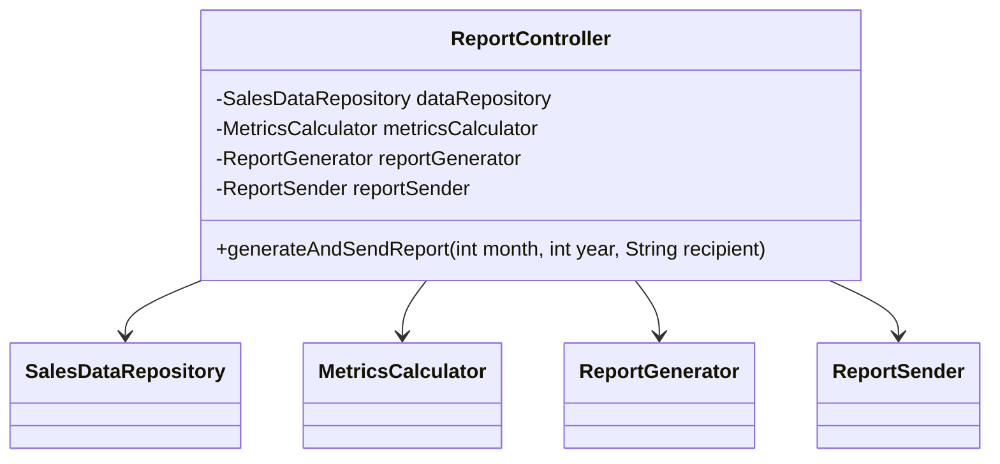

# Architecture Plan for "Refactoring Toward SOLID" Example Application

## 1. Initial Non-SOLID Design

The initial design will intentionally violate SOLID principles to demonstrate the problems that arise from such violations.

### Class Diagram



### Description of Initial Design

The initial `ReportService` class violates several SOLID principles:

1. **Single Responsibility Principle (SRP) Violation**: The class handles multiple responsibilities:
   - Data access (fetching sales data)
   - Business logic (calculating metrics)
   - Presentation (formatting reports)
   - Communication (sending emails)

2. **Open/Closed Principle (OCP) Violation**: To add new report formats or delivery methods, we would need to modify the existing class.

3. **Dependency Inversion Principle (DIP) Violation**: The class directly creates its dependencies rather than having them injected.

4. **Interface Segregation Principle (ISP) Violation**: If we were to create an interface for this class, it would be bloated with methods for different responsibilities.

### Sample Code Structure (Pseudo-code)

```java
public class ReportService {
    private List<SalesData> salesData;
    
    public void generateMonthlyReport(int month, int year, String recipient) {
        // Fetch data
        fetchSalesData(month, year);
        
        // Calculate metrics
        double totalSales = calculateTotalSales();
        Map<String, Double> growthPercentages = calculateGrowthPercentages();
        
        // Format report
        String report = formatReportAsText(totalSales, growthPercentages);
        
        // Send report
        sendReportByEmail(report, recipient);
    }
    
    private void fetchSalesData(int month, int year) {
        // In a real app, this would fetch from a database
        // For demo, generate random sales data
        salesData = new ArrayList<>();
        // Add hardcoded or random data...
    }
    
    private double calculateTotalSales() {
        // Calculate total sales from salesData
        return salesData.stream().mapToDouble(SalesData::getAmount).sum();
    }
    
    private Map<String, Double> calculateGrowthPercentages() {
        // Calculate growth percentages by product category
        // Complex business logic here...
        return new HashMap<>();
    }
    
    private String formatReportAsText(double totalSales, Map<String, Double> growthPercentages) {
        // Format the report as text
        StringBuilder report = new StringBuilder();
        report.append("Monthly Sales Report\n");
        report.append("Total Sales: $").append(totalSales).append("\n");
        // Add more formatting...
        return report.toString();
    }
    
    private void sendReportByEmail(String report, String recipient) {
        // In a real app, this would send an email
        // For demo, just print to console
        System.out.println("Sending report to " + recipient);
        System.out.println(report);
    }
}
```

## 2. Refactored SOLID Design

The refactored design will adhere to all SOLID principles by properly separating concerns and using dependency injection.

### Class Diagram

```mermaid
classDiagram
    class ReportController {
        -SalesDataRepository dataRepository
        -ReportGenerator reportGenerator
        -ReportSender reportSender
        +generateAndSendReport(int month, int year, String recipient)
    }
    
    class SalesData {
        -String productCategory
        -double amount
        -LocalDate date
        +getProductCategory()
        +getAmount()
        +getDate()
    }
    
    interface SalesDataRepository {
        +List~SalesData~ getSalesData(int month, int year)
    }
    
    class InMemorySalesDataRepository {
        +List~SalesData~ getSalesData(int month, int year)
    }
    
    interface MetricsCalculator {
        +double calculateTotalSales(List~SalesData~ data)
        +Map~String, Double~ calculateGrowthPercentages(List~SalesData~ data)
    }
    
    class SalesMetricsCalculator {
        +double calculateTotalSales(List~SalesData~ data)
        +Map~String, Double~ calculateGrowthPercentages(List~SalesData~ data)
    }
    
    interface ReportGenerator {
        +String generateReport(List~SalesData~ data, double totalSales, Map~String, Double~ growthPercentages)
    }
    
    class TextReportGenerator {
        -MetricsCalculator metricsCalculator
        +String generateReport(List~SalesData~ data, double totalSales, Map~String, Double~ growthPercentages)
    }
    
    interface ReportSender {
        +void sendReport(String report, String recipient)
    }
    
    class ConsoleReportSender {
        +void sendReport(String report, String recipient)
    }
    
    ReportController --> SalesDataRepository
    ReportController --> ReportGenerator
    ReportController --> ReportSender
    InMemorySalesDataRepository ..|> SalesDataRepository
    SalesMetricsCalculator ..|> MetricsCalculator
    TextReportGenerator ..|> ReportGenerator
    TextReportGenerator --> MetricsCalculator
    ConsoleReportSender ..|> ReportSender
```

### Description of Refactored Design

The refactored design adheres to SOLID principles:

1. **Single Responsibility Principle (SRP)**: Each class has a single responsibility:
   - `SalesDataRepository`: Responsible for data access
   - `MetricsCalculator`: Responsible for business logic and calculations
   - `ReportGenerator`: Responsible for formatting reports
   - `ReportSender`: Responsible for delivering reports
   - `ReportController`: Orchestrates the process

2. **Open/Closed Principle (OCP)**: The system is open for extension but closed for modification:
   - New report formats can be added by creating new implementations of `ReportGenerator`
   - New delivery methods can be added by creating new implementations of `ReportSender`
   - New data sources can be added by creating new implementations of `SalesDataRepository`

3. **Liskov Substitution Principle (LSP)**: Implementations can be substituted for their interfaces without affecting the behavior of the system.

4. **Interface Segregation Principle (ISP)**: Interfaces are focused and specific to their clients' needs.

5. **Dependency Inversion Principle (DIP)**: High-level modules depend on abstractions, not concrete implementations.

## 3. Step-by-Step Refactoring Path

### Step 1: Extract Data Repository

Extract the data access functionality into a separate interface and implementation.

```mermaid
classDiagram
    class ReportService {
        -SalesDataRepository dataRepository
        +generateMonthlyReport(int month, int year, String recipient)
        -calculateTotalSales(List~SalesData~ data)
        -calculateGrowthPercentages(List~SalesData~ data)
        -formatReportAsText(double totalSales, Map~String, Double~ growthPercentages)
        -sendReportByEmail(String report, String recipient)
    }
    
    interface SalesDataRepository {
        +List~SalesData~ getSalesData(int month, int year)
    }
    
    class InMemorySalesDataRepository {
        +List~SalesData~ getSalesData(int month, int year)
    }
    
    ReportService --> SalesDataRepository
    InMemorySalesDataRepository ..|> SalesDataRepository
```

**SOLID Principle Introduced**: 
- **Single Responsibility Principle (SRP)**: Data access is now a separate responsibility.
- **Dependency Inversion Principle (DIP)**: ReportService now depends on an abstraction (SalesDataRepository interface) rather than a concrete implementation.

### Step 2: Extract Metrics Calculator

Extract the business logic for calculating metrics into a separate interface and implementation.

```mermaid
classDiagram
    class ReportService {
        -SalesDataRepository dataRepository
        -MetricsCalculator metricsCalculator
        +generateMonthlyReport(int month, int year, String recipient)
        -formatReportAsText(double totalSales, Map~String, Double~ growthPercentages)
        -sendReportByEmail(String report, String recipient)
    }
    
    interface SalesDataRepository {
        +List~SalesData~ getSalesData(int month, int year)
    }
    
    interface MetricsCalculator {
        +double calculateTotalSales(List~SalesData~ data)
        +Map~String, Double~ calculateGrowthPercentages(List~SalesData~ data)
    }
    
    class SalesMetricsCalculator {
        +double calculateTotalSales(List~SalesData~ data)
        +Map~String, Double~ calculateGrowthPercentages(List~SalesData~ data)
    }
    
    ReportService --> SalesDataRepository
    ReportService --> MetricsCalculator
    SalesMetricsCalculator ..|> MetricsCalculator
```

**SOLID Principle Introduced**: 
- **Single Responsibility Principle (SRP)**: Business logic is now a separate responsibility.
- **Open/Closed Principle (OCP)**: We can now extend the system with new calculation methods without modifying existing code.

### Step 3: Extract Report Generator

Extract the report formatting functionality into a separate interface and implementation.

```mermaid
classDiagram
    class ReportService {
        -SalesDataRepository dataRepository
        -MetricsCalculator metricsCalculator
        -ReportGenerator reportGenerator
        +generateMonthlyReport(int month, int year, String recipient)
        -sendReportByEmail(String report, String recipient)
    }
    
    interface ReportGenerator {
        +String generateReport(List~SalesData~ data, double totalSales, Map~String, Double~ growthPercentages)
    }
    
    class TextReportGenerator {
        +String generateReport(List~SalesData~ data, double totalSales, Map~String, Double~ growthPercentages)
    }
    
    ReportService --> SalesDataRepository
    ReportService --> MetricsCalculator
    ReportService --> ReportGenerator
    TextReportGenerator ..|> ReportGenerator
```

**SOLID Principle Introduced**: 
- **Single Responsibility Principle (SRP)**: Report formatting is now a separate responsibility.
- **Open/Closed Principle (OCP)**: We can now add new report formats (HTML, CSV, etc.) without modifying existing code.
- **Interface Segregation Principle (ISP)**: The ReportGenerator interface is focused on a specific task.

### Step 4: Extract Report Sender

Extract the email sending functionality into a separate interface and implementation.

```mermaid
classDiagram
    class ReportService {
        -SalesDataRepository dataRepository
        -MetricsCalculator metricsCalculator
        -ReportGenerator reportGenerator
        -ReportSender reportSender
        +generateMonthlyReport(int month, int year, String recipient)
    }
    
    interface ReportSender {
        +void sendReport(String report, String recipient)
    }
    
    class ConsoleReportSender {
        +void sendReport(String report, String recipient)
    }
    
    ReportService --> SalesDataRepository
    ReportService --> MetricsCalculator
    ReportService --> ReportGenerator
    ReportService --> ReportSender
    ConsoleReportSender ..|> ReportSender
```

**SOLID Principle Introduced**: 
- **Single Responsibility Principle (SRP)**: Report delivery is now a separate responsibility.
- **Open/Closed Principle (OCP)**: We can now add new delivery methods without modifying existing code.
- **Interface Segregation Principle (ISP)**: The ReportSender interface is focused on a specific task.

### Step 5: Rename ReportService to ReportController

Rename the ReportService class to ReportController to better reflect its orchestration role.



**SOLID Principle Reinforced**: 
- **Single Responsibility Principle (SRP)**: The controller's sole responsibility is to orchestrate the report generation and delivery process.
- **Dependency Inversion Principle (DIP)**: The controller depends on abstractions for all its functionality.

## 4. Explanation of SOLID Principles in the Refactored Design

### Single Responsibility Principle (SRP)

"A class should have only one reason to change."

In our refactored design:
- `SalesDataRepository` is responsible only for data access
- `MetricsCalculator` is responsible only for business calculations
- `ReportGenerator` is responsible only for formatting reports
- `ReportSender` is responsible only for delivering reports
- `ReportController` is responsible only for orchestrating the process

This separation ensures that each class has a single responsibility and a single reason to change.

### Open/Closed Principle (OCP)

"Software entities should be open for extension but closed for modification."

In our refactored design:
- New report formats can be added by creating new implementations of `ReportGenerator` without modifying existing code
- New delivery methods can be added by creating new implementations of `ReportSender` without modifying existing code
- New data sources can be added by creating new implementations of `SalesDataRepository` without modifying existing code
- New calculation methods can be added by creating new implementations of `MetricsCalculator` without modifying existing code

### Liskov Substitution Principle (LSP)

"Subtypes must be substitutable for their base types."

In our refactored design:
- Any implementation of `SalesDataRepository` can be used wherever the interface is expected
- Any implementation of `MetricsCalculator` can be used wherever the interface is expected
- Any implementation of `ReportGenerator` can be used wherever the interface is expected
- Any implementation of `ReportSender` can be used wherever the interface is expected

This ensures that the system remains functional when implementations are swapped.

### Interface Segregation Principle (ISP)

"Clients should not be forced to depend on methods they do not use."

In our refactored design:
- Each interface is focused on a specific responsibility
- Clients only depend on the interfaces they need
- Interfaces are kept small and cohesive

### Dependency Inversion Principle (DIP)

"High-level modules should not depend on low-level modules. Both should depend on abstractions."

In our refactored design:
- `ReportController` (high-level module) depends on abstractions (`SalesDataRepository`, `MetricsCalculator`, `ReportGenerator`, `ReportSender`)
- Implementations (low-level modules) depend on these same abstractions
- This allows for flexible configuration and easy testing

## 5. Benefits of the Refactored Design

1. **Maintainability**: Each class has a clear, single responsibility, making the code easier to understand and maintain.

2. **Extensibility**: New features (report formats, delivery methods, data sources) can be added without modifying existing code.

3. **Testability**: Components can be tested in isolation, with dependencies easily mocked.

4. **Flexibility**: Components can be swapped out or reconfigured without affecting the rest of the system.

5. **Reusability**: Components can be reused in different contexts or applications.